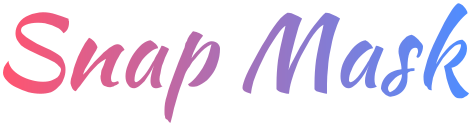
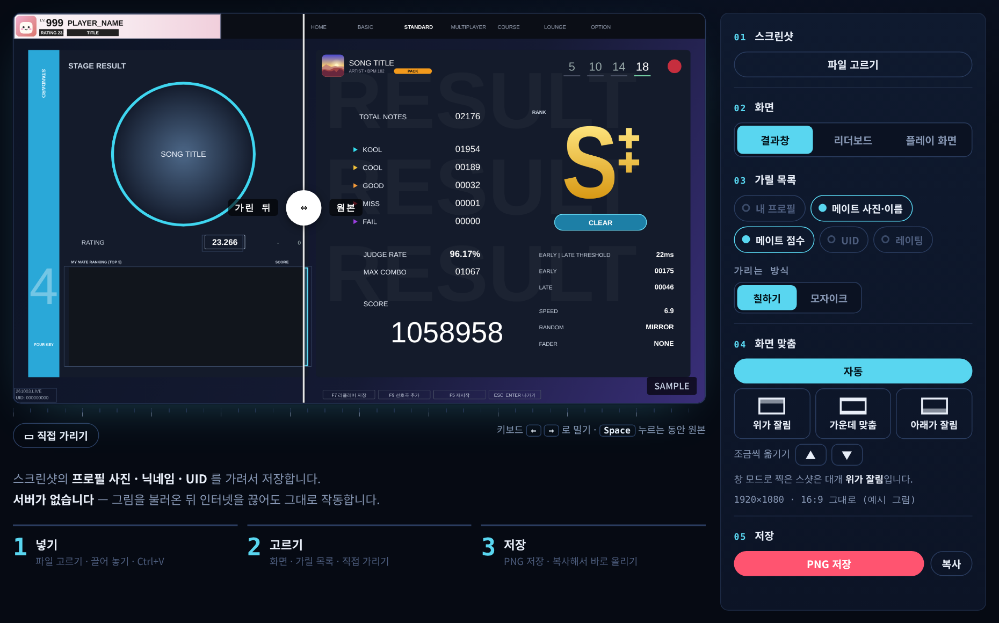

  

  <b>EZ2ON 스크린샷의 프로필 사진 · 닉네임 · UID 를 가려서 저장하는 웹 페이지</b>

  
  
  

  

결과창 · 리더보드 · 플레이 화면 스크린샷을 올리기 전에, 다른 사람의 정보와 내 정보를 한 번에 가릴 수 있습니다.

그림은 브라우저 안에서만 처리되며 어디에도 전송되지 않습니다. 불러온 뒤 인터넷을 끊어도 그대로 작동합니다.

## 시작하기

- **바로 쓰기** — https://laneworks.github.io/SnapMask/
- **파일로 받기** — [ZIP 내려받기](https://github.com/laneworks/SnapMask/archive/refs/heads/main.zip) → 압축을 풀고 `index.html` 을 더블클릭 (인터넷 없이 작동)

## 사용법

1. 스크린샷을 끌어 놓거나, 붙여 넣거나(Ctrl+V), «파일 고르기» 로 불러옵니다.
2. 화면 종류를 고릅니다 — 결과창 · 리더보드 · 플레이 화면 · 멀티 결과창
3. 가릴 목록을 켜고 끕니다. 미리보기에서 칸을 눌러도 됩니다.
4. 목록에 없는 곳은 «▭ 직접 가리기» 를 켜고 미리보기에서 끌어서 칠합니다.
5. «PNG 저장» 또는 «복사»

미리보기 손잡이 왼쪽은 가린 뒤, 오른쪽은 원본입니다. ← → 키로 손잡이를 옮기고, Space 를 누르는 동안은 원본만 보입니다.

### 여러 장 한꺼번에

- 스크린샷 여러 장을 한 번에 끌어 놓거나 «파일 고르기» 에서 여러 개를 고릅니다.
- 2.0 결과창 · 리더보드 · 플레이 화면은 스스로 골라 둡니다. 그 밖의 그림(2.0 전 화면 포함)은 «확인 필요» 로 빠지고 저장되지 않습니다.
  - 멀티 결과창은 아직 스스로 고르지 않습니다. «확인 필요» 그림을 열면 나오는 «이 그림은 무엇인가요?» 에서 «멀티» 를 고릅니다.
  - 잘못 고른 그림은 그림 아래 표시(예: «리더보드»)를 눌러 종류를 바꿉니다.
- 여러 장일 때 «화면» 탭은 그 종류 그림으로 넘어가는 단추입니다. 눌러도 그림의 종류는 바뀌지 않습니다.
- 가릴 목록은 화면 종류마다 하나입니다. 화면 맞춤과 «직접 가리기» 는 그림마다 따로입니다.
- «N장 ZIP 으로 저장» — 두 장 이상이면 ZIP 파일 하나로 받습니다. JPG 로 넣은 그림은 JPG, PNG 는 PNG 로 저장됩니다.

## 가리는 곳

| 화면 | 기본으로 가리는 곳 | 골라서 켜는 곳 |
|---|---|---|
| 결과창 | 메이트 사진·이름 · 메이트 점수 | 내 프로필 · UID · 레이팅 |
| 리더보드 | 내 프로필 · PLAYER 1~10 · UID | — |
| 플레이 화면 | 프로필 카드 · UID | — |
| 멀티 결과창 | 내 프로필 · PLAYER 1~8 · 메이트 순위 · UID | — |

점수 · JUDGE RATE · 순위는 가리지 않습니다.

### 칠하기와 모자이크

- **칠하기**(기본) — 한 색으로 덮습니다. 가장 안전합니다.
- **모자이크** — 사진에는 자연스럽지만, UID 처럼 짧은 글자는 복원 도구로 되살릴 수 있어 권장하지 않습니다.

## 칸이 어긋날 때

화면 비율과 검은 띠를 재서 칸을 자동으로 맞춥니다(16:9 · 16:10 · 21:9 · 창 모드). 그래도 어긋나 보이면 아래 중에서 고릅니다.

| 단추 | 이런 스크린샷 |
|---|---|
| 위가 잘림 | 창 모드로 찍어 위쪽이 잘린 것 (가장 흔함) |
| 가운데 맞춤 | 위아래나 좌우에 검은 띠가 있는 것 |
| 아래가 잘림 | 아래쪽이 잘린 것 |

▲▼ 로 미세 조정할 수 있습니다. 창 테두리까지 찍힌 캡처보다 게임 안 스크린샷(Steam F12 등)이 더 정확합니다.

## 참고

- 게임 화면 배치가 바뀌면 칸이 어긋날 수 있습니다. «직접 가리기» 로 메우고 [Issues](https://github.com/laneworks/SnapMask/issues) 로 알려 주시면 수정하겠습니다.
- EZ2ON 팬이 만든 비공식 도구입니다. 게임 관련 권리는 각 권리자에게 있습니다.

## 라이선스

- 코드 — [MIT](LICENSE)
- 글꼴 — [SIL Open Font License 1.1](OFL.txt)
  - 아래 줄 글씨: Nanum Pen Script 에서 쓰는 글자만 뽑아 «SM Pen» 이라는 이름으로 포함
  - 로고: Kaushan Script 로 쓴 글자를 그림(SVG)으로 변환 (글꼴 파일 미포함)
